<p align="center">
  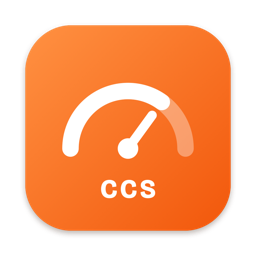
</p>

<h1 align="center">CC Supervisor</h1>

<p align="center">
  Keep track of your Claude Code subscription limits across several accounts on macOS, and get more out of them.<br>
  Desktop widgets · a menu bar app · a supervised <code>claude</code> launcher · automatic pause, resume and warm-ups
</p>

<p align="center">
  <a href="https://github.com/mihaliak/cc-supervisor/actions/workflows/python.yml"></a>
  <a href="https://github.com/mihaliak/cc-supervisor/actions/workflows/swift.yml"></a>
  <a href="LICENSE"></a>
  
  
  
</p>

If you use Claude Code with more than one account or config dir, say personal and work, CC Supervisor does four things:
- It shows every profile's session, weekly, model and extra-usage limits at a glance.
- It warns you before a limit runs out.
- It pauses your sessions while there's still headroom left.
- It picks them up again once the window resets.

## Features

**Profiles and sign-in**
- **Multiple profiles:** one per Claude Code config dir (`CLAUDE_CONFIG_DIR`), each with a name, an emoji and a launcher flag.
- **Sign-in:** each profile uses Claude Code's own login. No passwords or tokens are stored.

**Seeing your usage**
- **Desktop widgets:** small (bar or gauge), medium and large, one profile per widget, in light and dark.
- **Menu bar app:**
  - The menu bar shows every profile's session and weekly percent.
  - A dropdown lists all limits with their reset times.
  - Quick actions: refresh, warm up, pause and resume.
- **Statusline:** shows the profile, folder, model and effort, a usage bar with a reset countdown, warnings and the pause state.
- **Native notifications:** for warnings, pauses, resumes, warm-ups and errors. Each type can be switched off.

**Supervising your sessions**
- **`ccs --work` launcher:** runs the normal interactive Claude Code with the right config dir, the statusline and supervision.
- **Limit supervision:**
  - Warns at 80 %.
  - Pauses `ccs` sessions at 90 % (session) or 95 % (weekly).
  - Resumes them automatically after the reset with a "continue" prompt.
  - Typing into a paused session overrides the pause.
  - Every threshold is set per profile.
- **Model-scoped limits and extra usage:** limits such as Fable get their own handling, and so do paid credits ("spill into credits").
- **Warm-ups:** start a 5-hour window early, so you get more windows per day. They can run on a schedule, at app start, on unlock or wake, or right after a window resets.

**Command line and install**
- **`ccs` CLI:** status, usage, sessions, events, pause and resume, sign-in, statusline apply and revert, and `ccs doctor` with fix hints.
- **One-command install:**
  - `make install`, `make upgrade` and `make uninstall`.
  - The background supervisor runs under launchd.
  - Nothing in your Claude config dirs changes unless you ask.

## Installation

### Requirements
- macOS 26 (Tahoe) or later
- Xcode 26 (the full app, not only the Command Line Tools)
- Python 3.12+ and [pipx](https://pipx.pypa.io) (`brew install pipx`)
- [XcodeGen](https://github.com/yonaskolb/XcodeGen) (`brew install xcodegen`)
- [Claude Code](https://claude.com/claude-code)

### Install
```sh
git clone https://github.com/mihaliak/cc-supervisor.git
cd cc-supervisor
make install
```

`make install` does the following:
- checks the prerequisites
- installs the `ccs` CLI with pipx
- builds the app and widgets into `~/Applications`
- starts the background supervisor (a LaunchAgent)
- turns on Launch at login
- finishes with `ccs doctor`

It never touches your Claude config dirs.

### First steps
1. **Profiles:** `personal` (`~/.claude`) and `work` (`~/.claude-work`) are created for you. Edit them or add more in menu bar → **Settings… → Profiles**.
2. **Sign in:** click **Sign in** for each profile. It's Claude Code's own claude.ai login for that config dir.
3. **Widgets:**
   1. Right-click the desktop → **Edit Widgets…**
   2. Search for "CC Supervisor" and add a widget.
   3. Right-click the widget → **Edit Widget** → pick the profile.
4. **Work:**
   ```sh
   ccs --work          # Claude Code with the work account, supervised
   ccs --personal -c   # continue the last personal conversation
   ```
5. **Something off?** `ccs doctor` checks everything and tells you how to fix it.

**Updating and removing:**
- Update with `git pull && make upgrade`.
- Remove everything with `make uninstall`.

Builds are ad-hoc signed for your own Mac, so you don't need an Apple developer account. The full manual is in [docs/manual](docs/manual/README.md).

## Screenshots
Every image below is rendered from the app's and CLI's real code with made-up demo accounts and usage. Regenerate them with `make screenshots`.

### Desktop widgets
<picture>
  <source media="(prefers-color-scheme: dark)" srcset="docs/assets/screenshots/widgets-dark.png">
  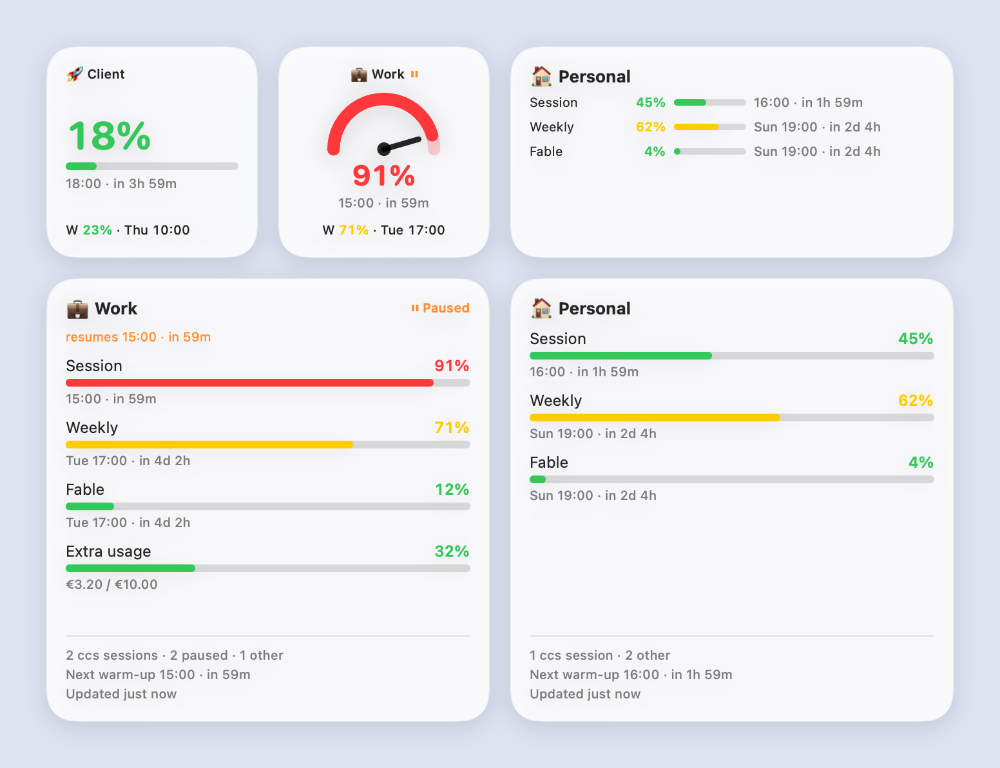
</picture>

Each widget shows one profile.
- **Sizes:** small (bar or gauge), medium or large.
- **Colors:** bars and percents are green, yellow or red depending on usage.
- **Paused profile:** shows ⏸ and when it resumes.
- **Large widget:** also lists the supervised sessions and the next warm-up.

### Menu bar
<picture>
  <source media="(prefers-color-scheme: dark)" srcset="docs/assets/screenshots/menu-dark.png">
  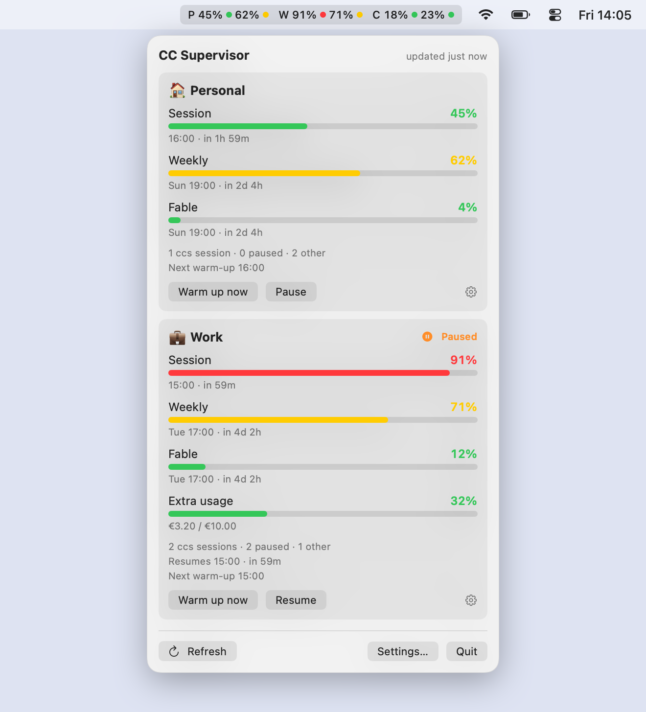
</picture>

**The label:** each profile's letter, session % and weekly %, with colored dots.

**The dropdown:**
- every limit with its reset time and countdown
- the sessions the supervisor can see
- the next warm-up
- one-click **Warm up now**, **Pause** and **Resume**

### Notifications
<picture>
  <source media="(prefers-color-scheme: dark)" srcset="docs/assets/screenshots/notifications-dark.png">
  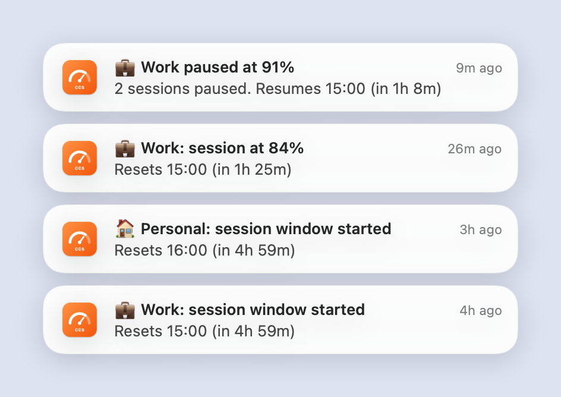
</picture>

Native notifications when:
- a limit gets close
- sessions are paused or resumed
- a warm-up starts a new window
- something needs your attention, such as a sign-in or an invalid config

### Statusline and the `ccs` launcher
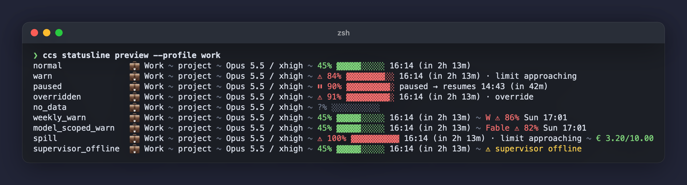

`ccs --work` adds this statusline to Claude Code. It shows:
- profile, folder, model and effort
- the session usage bar and its reset time
- warnings, and the ⏸ pause state

`ccs statusline apply` shows it in plain `claude` too. The image shows every state via `ccs statusline preview`.

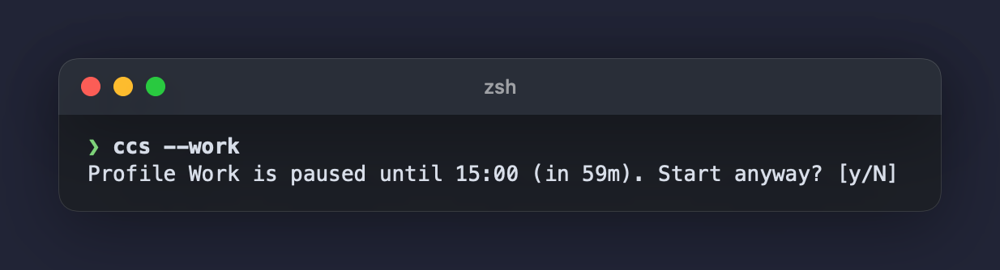

Starting a session while its profile is paused asks first. Answering `y` starts it as overridden.

### Settings
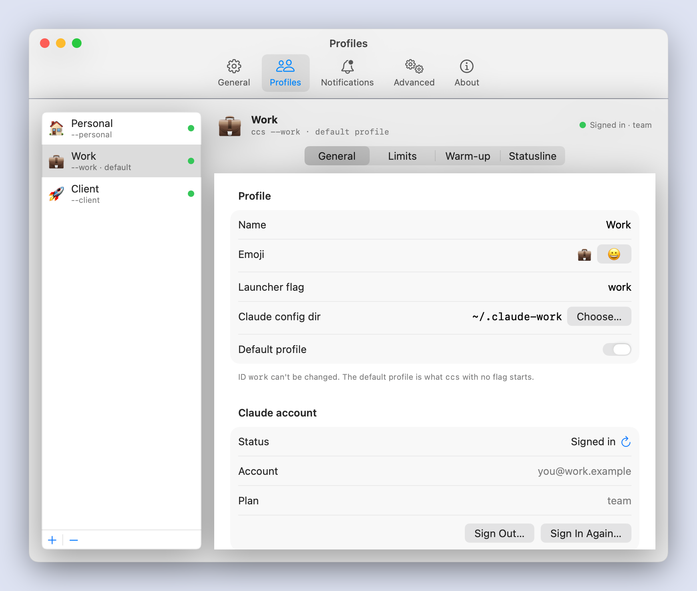

**Profiles:**
- name, emoji, launcher flag and Claude config dir
- the Claude account the profile is signed in to, with sign in and sign out

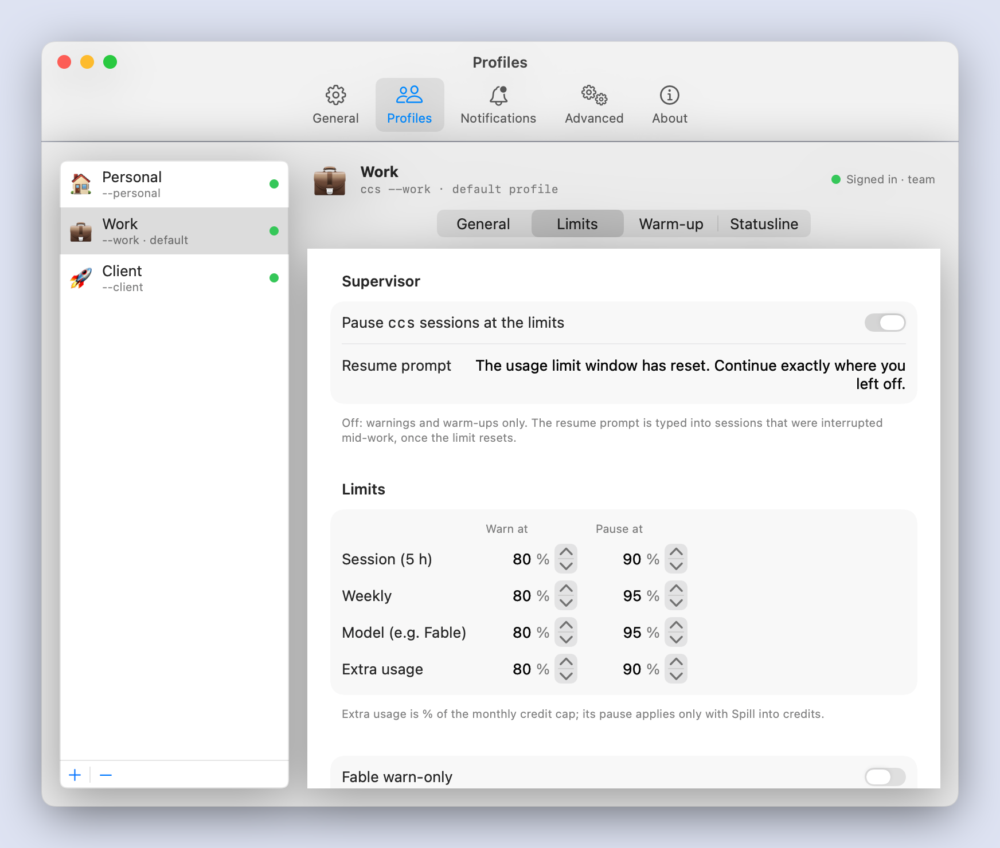

**Limits:**
- supervision on or off, and the resume prompt
- warn and pause thresholds for the session, weekly, model-scoped and extra-usage limits

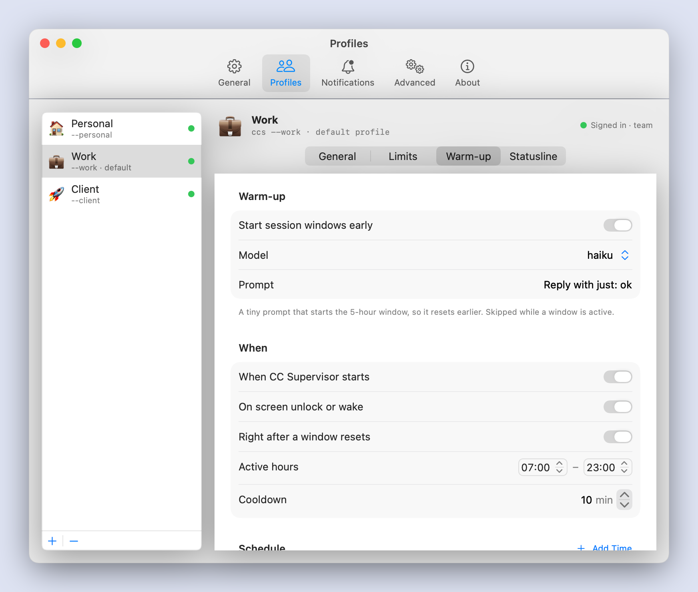

**Warm-up:**
- model and prompt
- triggers: app start, unlock or wake, right after a window resets
- active hours, cooldown and a weekly schedule

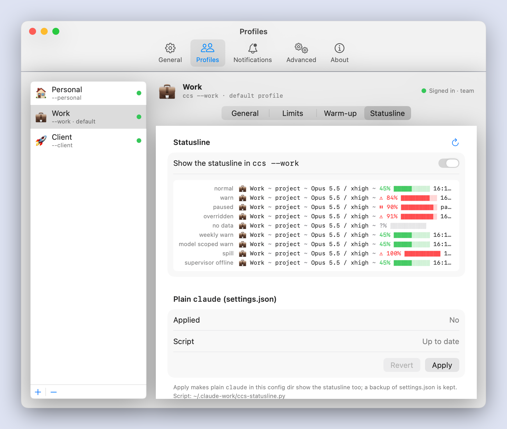

**Statusline:**
- a live preview of every state
- apply to or revert from plain `claude`

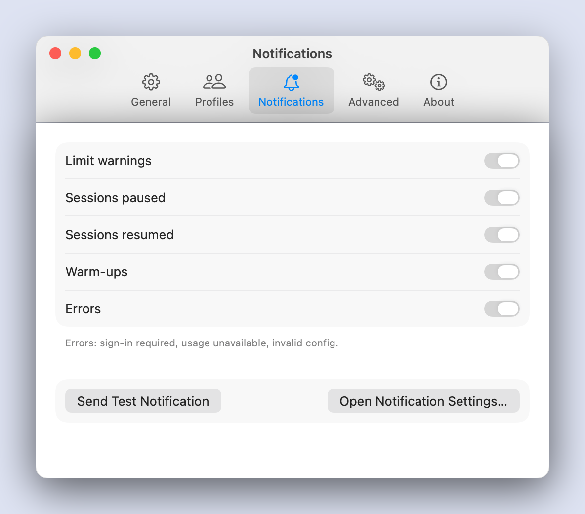

**Notifications:** a switch for each type, plus a test notification.

### Command line
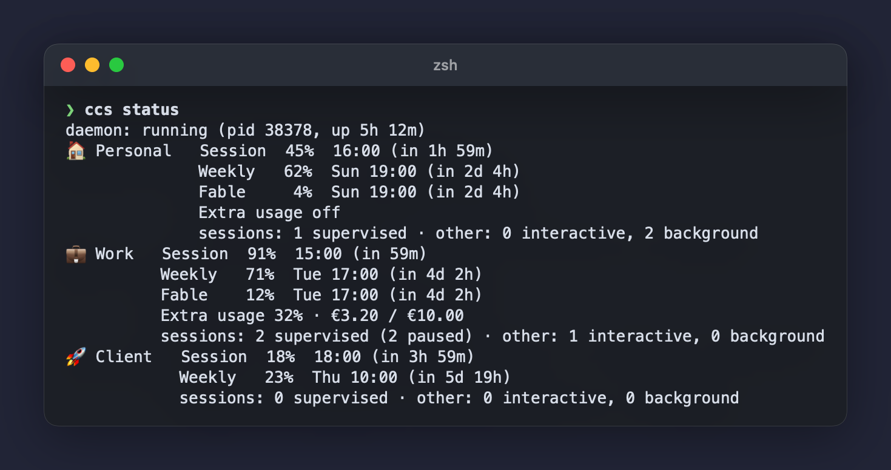

`ccs status`: usage per profile, sessions, and the supervisor's health.

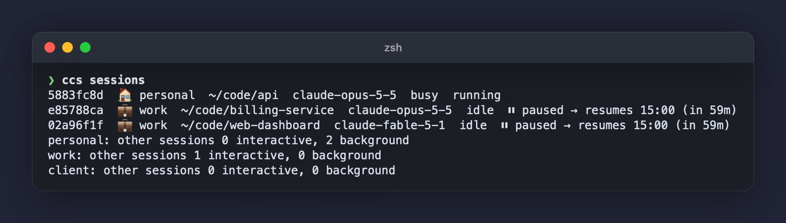

`ccs sessions`: every supervised session with its folder, model, activity and pause state. Use the short ids with `ccs pause` and `ccs resume`.

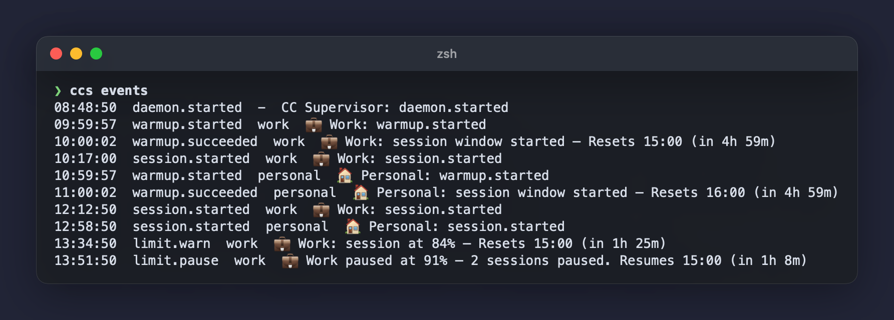

`ccs events`: what the supervisor did and when.

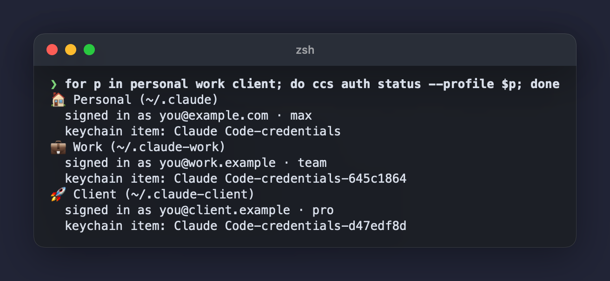

`ccs auth status`: which account each profile is signed in to.

<details>
<summary><code>ccs doctor</code>: every check, with fix hints</summary>

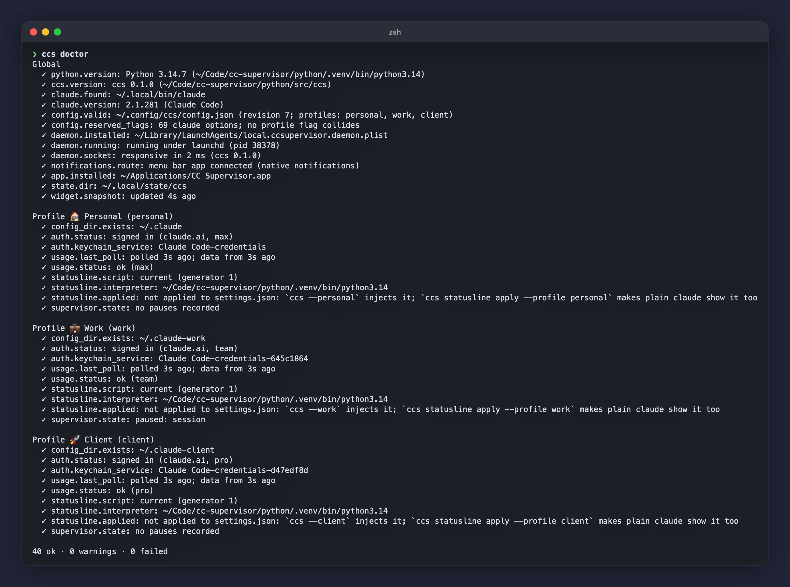
</details>

## License
MIT, see [LICENSE](LICENSE). The app icon uses [Bricolage Grotesque](https://fonts.google.com/specimen/Bricolage+Grotesque) under the SIL Open Font License ([OFL.txt](macos/Branding/fonts/OFL.txt)).

### Vibe coded with Claude
This project is vibe coded. It was designed, written, tested and documented with Anthropic's [Claude](https://claude.com) in [Claude Code](https://claude.com/claude-code), steered and reviewed by a human. Treat it like any hobby project and read the code before you trust it with your setup.

CC Supervisor is an independent project. It isn't affiliated with or endorsed by Anthropic. Claude and Claude Code are trademarks of Anthropic.
